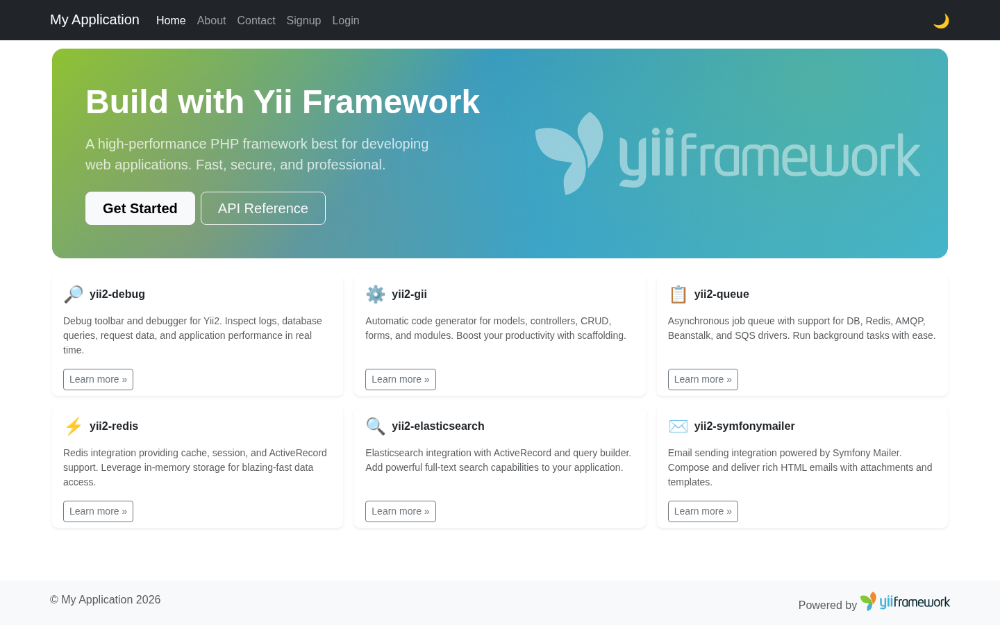

<!-- markdownlint-disable MD041 -->
<p align="center">
    <picture>
        <source media="(prefers-color-scheme: dark)" srcset="https://www.yiiframework.com/image/design/logo/yii3_full_for_dark.svg">
        <source media="(prefers-color-scheme: light)" srcset="https://www.yiiframework.com/image/design/logo/yii3_full_for_light.svg">
        
    </picture>
    <h1 align="center">Basic Application Template</h1>
    <br>
</p>
<!-- markdownlint-enable MD041 -->

Basic Application Template is a skeleton [Yii 2](https://www.yiiframework.com/) application best suited for rapidly
creating small projects. It includes user login/logout, a contact page with masked phone input, and all commonly
used configurations.

Use the **"Use this template"** button on GitHub to create your own repository from this template.

[](https://github.com/yii2-framework/app-basic/actions?query=workflow%3Abuild)
[](https://codecov.io/gh/yii2-framework/app-basic)
[](https://github.com/yii2-framework/app-basic/actions/workflows/static.yml)

<picture>
    <source media="(prefers-color-scheme: dark)" srcset="docs/images/home-dark.png">
    <source media="(prefers-color-scheme: light)" srcset="docs/images/home-light.png">
    
</picture>

## Docker

[](https://github.com/yii2-framework/app-basic/actions/workflows/docker.yml)

## Directory structure

```text
config/             contains application configurations
public/             contains the entry script and Web resources
resources/
    mail/           contains view files for e-mails
    views/          contains view files for the Web application
runtime/            contains files generated during runtime
src/
    Assets/         contains assets definition
    Commands/       contains console commands (controllers)
    Controllers/    contains Web controller classes
    Models/         contains model classes
    Widgets/        contains widget classes
tests/              contains various tests for the basic application
vendor/             contains dependent 3rd-party packages
```

## Requirements

The minimum requirement of this project template is that your web server supports PHP 8.2.

## Installation

> [!IMPORTANT]
>
> - The minimum required [PHP](https://www.php.net/) version is PHP `8.2`.

## Install via Composer

If you do not have [Composer](https://getcomposer.org/), you may install it by following the instructions
at [getcomposer.org](https://getcomposer.org/doc/00-intro.md#installation-nix).

You can then install this project using the following command:

```bash
composer create-project --prefer-dist yii2-framework/app-basic app-basic
```

Now you should be able to access the application through the following URL, assuming `app-basic` is the directory
directly under the Web root.

```text
http://localhost/app-basic/public/
```

## Install with Docker

Update your vendor packages

```bash
docker-compose run --rm php composer update --prefer-dist
```

Run the installation triggers (creating cookie validation code)

```bash
docker-compose run --rm php composer install
```

Start the container

```bash
docker-compose up -d
```

You can then access the application through the following URL:

```text
http://127.0.0.1:8000
```

Run tests inside the container

```bash
docker compose exec -T php vendor/bin/codecept build
docker compose exec -T php vendor/bin/codecept run
```

**NOTES:**

- Minimum required Docker engine version `17.04` for development (see [Performance tuning for volume mounts](https://docs.docker.com/docker-for-mac/osxfs-caching/))
- The default configuration uses a host-volume in your home directory `~/.composer-docker/cache` for Composer caches

## Configuration

## Database

Edit the file `config/db.php` with real data, for example:

```php
return [
    'class' => 'yii\db\Connection',
    'dsn' => 'mysql:host=localhost;dbname=yii2basic',
    'username' => 'root',
    'password' => '1234',
    'charset' => 'utf8',
];
```

**NOTES:**

- Yii won't create the database for you, this has to be done manually before you can access it.
- Check and edit the other files in the `config/` directory to customize your application as required.
- Refer to the readme in the `tests` directory for information specific to basic application tests.

## Testing

Tests are located in `tests` directory. They are developed with [Codeception PHP Testing Framework](https://codeception.com/).
By default, there are 3 test suites:

- `unit`
- `functional`
- `acceptance`

Tests can be executed by running

```bash
vendor/bin/codecept run --env php-builtin
```

The command above will execute all test suites (unit, functional, and acceptance). Unit tests verify system components,
functional tests emulate web requests, and acceptance tests run against a real HTTP server.

## Acceptance tests

The `acceptance` suite is configured in `tests/Acceptance.suite.yml`.

### Acceptance tests (PhpBrowser)

By default, acceptance tests use the `PhpBrowser` module and run against the built-in PHP web server started via the
`php-builtin` environment.

```bash
# run all tests with built-in web server
composer tests

# run acceptance tests only
vendor/bin/codecept run Acceptance --env php-builtin
```

### Acceptance tests (WebDriver + Selenium)

To run acceptance tests in a real browser, switch the `acceptance` suite to use the `WebDriver` module.
`tests/Acceptance.suite.yml` contains an example WebDriver configuration (commented).

1. Download and start [Selenium Server](https://www.selenium.dev/downloads/).
2. Install the corresponding browser driver (for example. [GeckoDriver](https://github.com/mozilla/geckodriver/releases) or
   [ChromeDriver](https://googlechromelabs.github.io/chrome-for-testing/)).
3. Update `tests/Acceptance.suite.yml` to enable `WebDriver` and disable `PhpBrowser`.
4. Run:

```bash
vendor/bin/codecept run Acceptance --env php-builtin
```

## Code coverage support

Code coverage is configured in `codeception.yml`. You can run your tests and collect coverage with the following command:

```bash
# collect coverage for all tests
vendor/bin/codecept run --coverage --coverage-html --coverage-xml --env php-builtin

# collect coverage only for unit tests
vendor/bin/codecept run Unit --coverage --coverage-html --coverage-xml --env php-builtin

# collect coverage for unit and functional tests
vendor/bin/codecept run Functional,Unit --coverage --coverage-html --coverage-xml --env php-builtin
```

You can see code coverage output under the `tests/Support/output` directory.

## Our social networks

[](https://x.com/Terabytesoftw)

## License

[](LICENSE)
